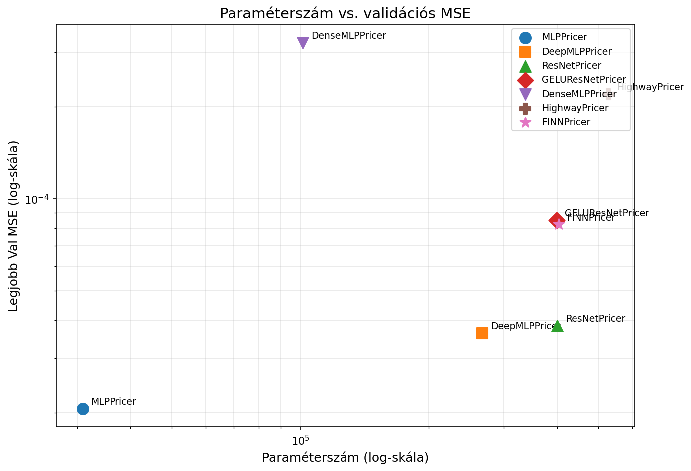
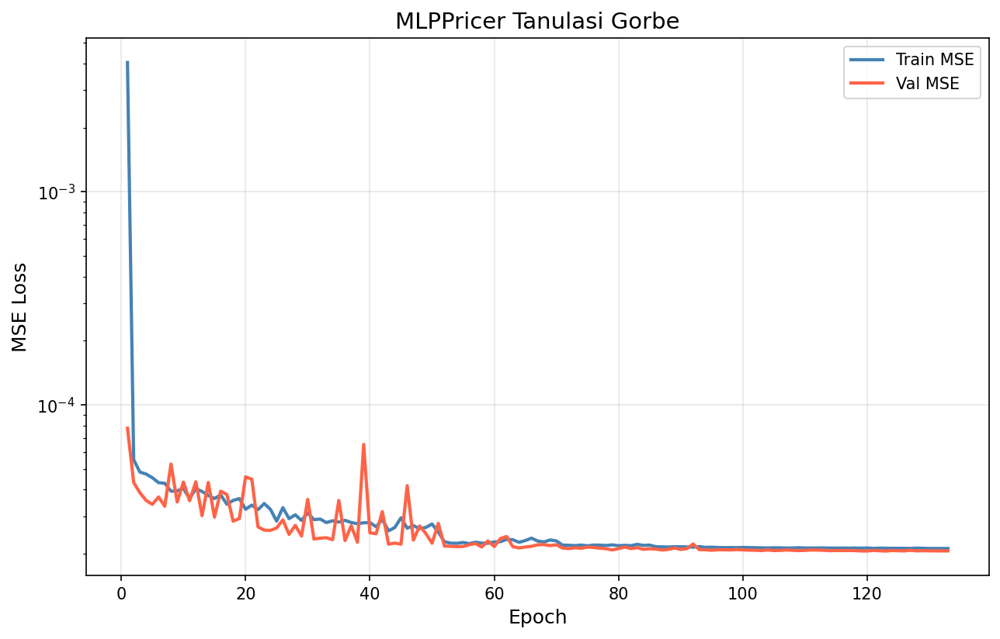
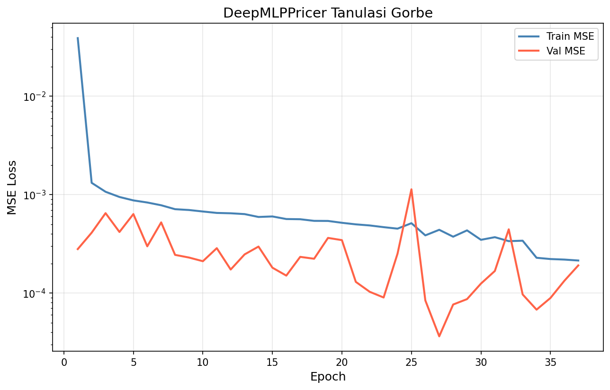
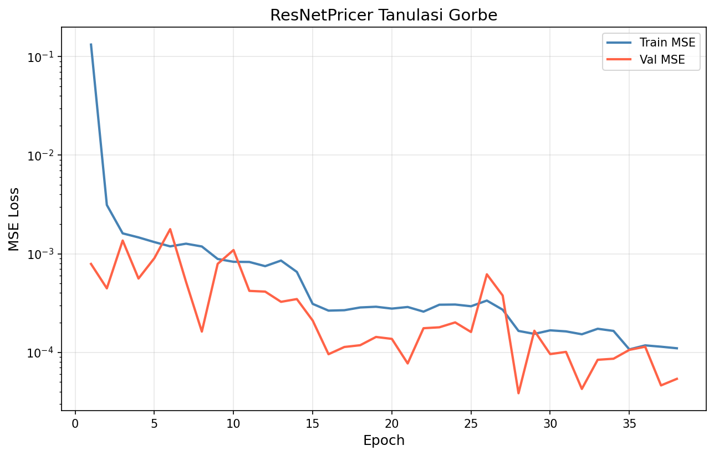
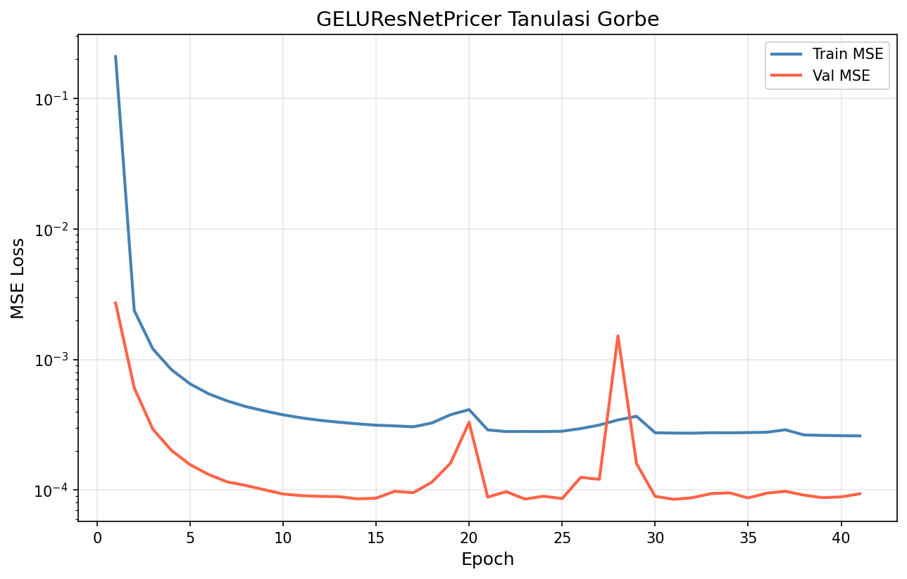
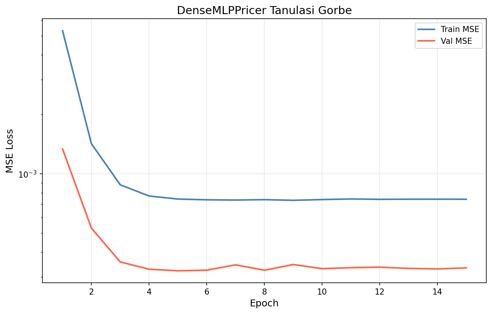
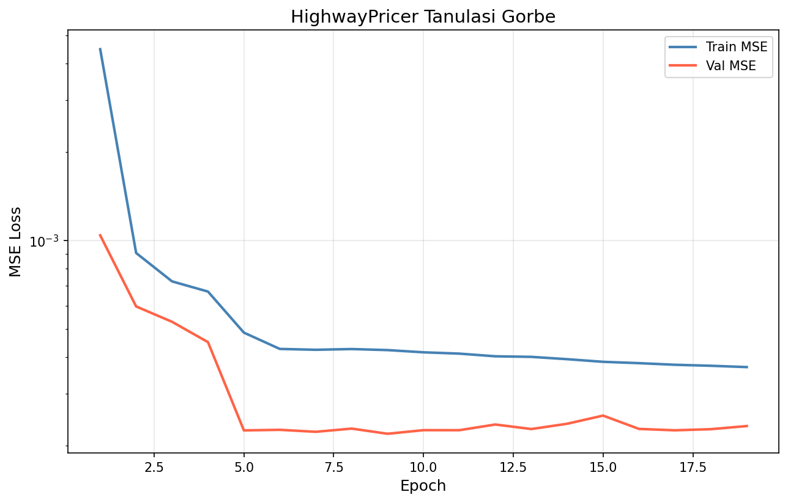
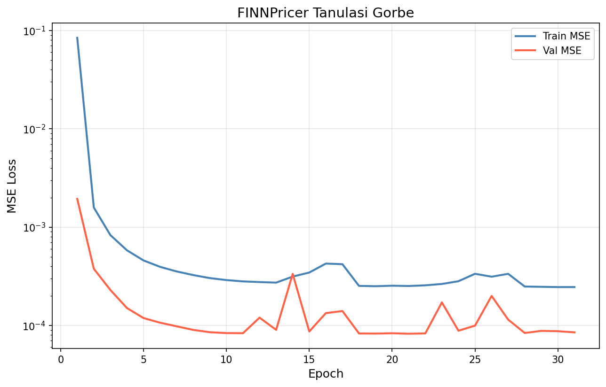
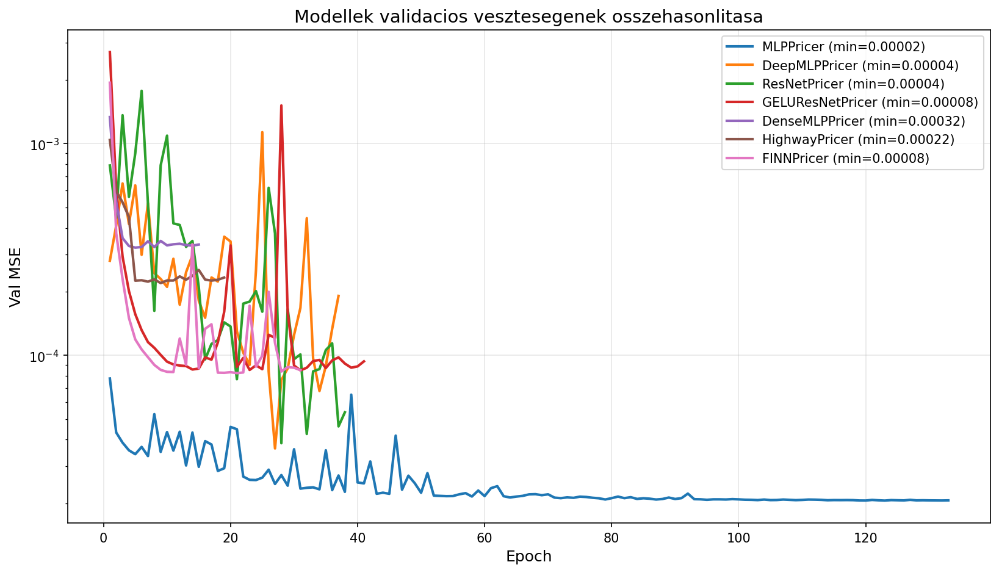
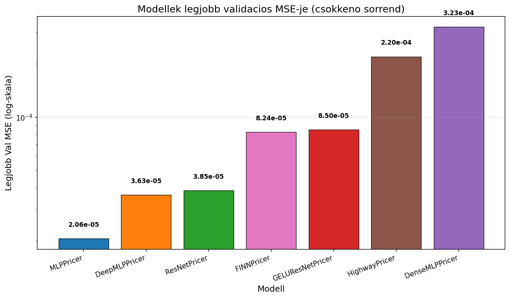

# Modell-összehasonlítás: Neurális háló architektúrák Black-Scholes opciós árazáshoz

## 1. Bevezetés

### Kísérlet célja

A kísérlet célja hét különböző neurális háló architektúra szisztematikus összehasonlítása Black-Scholes szintetikus adatokon alapuló call opció árazási feladaton. Az összehasonlítás segítségével megállapítható, hogy melyik architektúra-tervezési döntés (reziduális kapcsolatok, normalizáció típusa, aktivációs függvény, sűrű összefűzés, tanulható gating, kétágú felépítés) vezet a legjobb általánosítási teljesítményhez.

### Egységes hiperparaméterek

Minden modell azonos körülmények között lett betanítva:

| Hiperparaméter   | Érték        |
|------------------|--------------|
| `epochs`         | 200          |
| `batch_size`     | 4096         |
| `lr`             | 1e-3         |
| `weight_decay`   | 1e-4         |
| `patience`       | 10           |
| `seed`           | 42           |

### Adathalmaz

Az adathalmaz Black-Scholes képlettel generált szintetikus opciós adatokat tartalmaz (q=0 feltételezéssel, azaz osztalékhozam nélkül):

- **Bemeneti jellemzők (4 db):** S/K (moneyness), T (lejáratig hátralévő idő), r (kockázatmentes kamatláb), σ (volatilitás)
- **Kimeneti változó:** normalizált call ár (C/K)
- **Tanítóhalmaz:** 700 000 minta
- **Validációs halmaz:** 150 000 minta
- **Generáló script:** `generate_dataset.py`

---

## 2. Eredmények táblázata

Az alábbi táblázat a modellek teljesítményét mutatja csökkenő pontosság szerint (legjobb validációs MSE alapján, kisebb = jobb):

| Modell            | Architektúra típusa              | Paraméterszám | Legjobb Val MSE        | Legjobb Epoch | Végső LR    |
|-------------------|----------------------------------|---------------|------------------------|---------------|-------------|
| MLPPricer         | Baseline MLP (ReLU)              | ~30 900       | 2.0607e-05             | 123           | 1.5625e-05  |
| DeepMLPPricer     | Mélyebb MLP (LayerNorm + Dropout)| ~265 000      | 3.6347e-05             | 27            | 2.5000e-04  |
| ResNetPricer      | Reziduális MLP (BatchNorm)       | ~400 000      | 3.8462e-05             | 28            | 1.2500e-04  |
| FINNPricer        | Kétágú (approx + correction)     | ~402 000      | 8.2406e-05             | 21            | 2.5000e-04  |
| GELUResNetPricer  | Reziduális MLP (LayerNorm + GELU)| ~400 000      | 8.4989e-05             | 31            | 1.2500e-04  |
| HighwayPricer     | Highway gating (GELU)            | ~528 000      | 2.1954e-04             | 9             | 5.0000e-04  |
| DenseMLPPricer    | DenseNet összefűzés (GELU)       | ~102 000      | 3.2283e-04             | 5             | 5.0000e-04  |

> **Megjegyzés:** A „Legjobb Val MSE" értékek közvetlenül a JSON history fájlokból (`best_val_loss` mező) olvasottak.

---

## 3. Tanulási dinamika

### Konvergencia sebesség

A modellek konvergencia sebessége jelentősen eltér egymástól:

- **Gyors konvergencia (5–10 epoch):** DenseMLPPricer (5. epoch) és HighwayPricer (9. epoch) nagyon korán elérték legjobb validációs értéküket, de a végeredmény gyenge maradt. Ez arra utal, hogy ezek a modellek gyorsan platóra értek és nem tudtak tovább finomulni.

- **Közepes konvergencia (20–30 epoch):** DeepMLPPricer (27.), ResNetPricer (28.), GELUResNetPricer (31.) és FINNPricer (21.) a tanítás első harmadában megtalálták optimumukat. Jóval jobb végeredményt értek el, mint a korai megállók.

- **Lassú, folyamatos konvergencia (100+ epoch):** Az MLPPricer a 123. epochban érte el legjobb eredményét, végig tanult a teljes 134 epochon át (az LR scheduling végéig). Ez az egyszerű architektúra különösen sok iterációból profitált.

### Early stopping viselkedés

Az early stopping (patience=10) különbözőképpen érintette a modelleket:

| Modell           | Összes epoch | Early stop? | Megjegyzés                                         |
|------------------|-------------|-------------|----------------------------------------------------|
| MLPPricer        | 134         | Igen        | Hosszan tanult, az LR scheduling segítette végig   |
| DeepMLPPricer    | 37          | Igen        | Korán megállt, de jó eredményt ért el              |
| ResNetPricer     | 38          | Igen        | Hasonló DeepMLP-hez, hektikusabb validációs görbe  |
| GELUResNetPricer | 41          | Igen        | Lassabban konvergált, mint BatchNorm párja         |
| FINNPricer       | 31          | Igen        | A leghatékonyabb tanulási ív az összetett modellek között |
| HighwayPricer    | 19          | Igen        | Nagyon korán megállt, gyenge eredménnyel           |
| DenseMLPPricer   | 15          | Igen        | Legkorábban megállt, leggyengébb eredménnyel       |

### LR Scheduling

Az összes modell ReduceLROnPlateau típusú ütemezőt alkalmazott (factor=0.5, patience=10 alapján). A többszörös LR csökkentés különösen az MLPPricernél volt megfigyelhető (1e-3 → 5e-4 → 2.5e-4 → 1.25e-4 → 6.25e-5 → 3.125e-5 → 1.5625e-5), amely végig reagált a tanulásra és folyamatosan finomult.

---

## 4. Architektúra-összehasonlítás

### 4.1 Reziduális kapcsolatok: ResNetPricer vs. MLPPricer

Az MLPPricer (2.0607e-05) szignifikánsan jobb validációs MSE-t ért el, mint a ResNetPricer (3.8462e-05), annak ellenére, hogy az utóbbi kb. 13-szor több paramétert tartalmaz (~400 000 vs. ~30 900). Ez látszólag ellentmondásos, de magyarázható:

1. Az MLPPricer lényegesen hosszabb ideig tanult (123 epoch vs. 28 epoch), és a folyamatos LR-csökkentésből profitált.
2. A Black-Scholes függvény viszonylag sima, közel-lineárisan approximálható — egy egyszerű MLP elegendő kapacitással bír.
3. A ResNetPricer BatchNorm rétegei potenciálisan instabilitást okoztak (a validációs görbe hektikus volt), ami korai megálláshoz vezetett.

### 4.2 Normalizáció: BatchNorm vs. LayerNorm

A ResNetPricer (BatchNorm, 3.8462e-05) vs. GELUResNetPricer (LayerNorm, 8.4989e-05) összehasonlítása alapján a BatchNorm kedvezőbbnek bizonyult ennél a feladatnál. Azonban fontos megjegyezni, hogy a két modell nemcsak normalizációban, hanem aktivációban is különbözik (ReLU vs. GELU), ezért ez nem tiszta összehasonlítás.

A DeepMLPPricer (LayerNorm, 3.6347e-05) szintén jó eredményt ért el LayerNorm-mal, ami arra utal, hogy a LayerNorm önmagában nem hátrány — a ResNetPricer vs. GELUResNetPricer különbsége valószínűleg inkább az aktivációs függvénynek tudható be.

### 4.3 Aktiváció: ReLU vs. GELU

Közvetlen összehasonlítás: ResNetPricer (ReLU + BatchNorm, 3.8462e-05) vs. GELUResNetPricer (GELU + LayerNorm, 8.4989e-05). A ReLU-s változat jobb eredményt adott, bár a confound (BatchNorm vs. LayerNorm különbség) megnehezíti az egyértelmű következtetést.

A GELUResNetPricer elméleti előnye (simább gradiens a BS árak sima természetéhez) a gyakorlatban nem hozott mért javulást a baseline ResNetPricerhez képest.

### 4.4 DenseNet összefűzés: DenseMLPPricer

A DenseMLPPricer a leggyengébb teljesítményt nyújtotta (3.2283e-04), annak ellenére, hogy a DenseNet-stílusú összefűzés (Huang et al., 2017) elvileg jobb gradiens-áramlást biztosít. A gyors early stopping (5. epoch, végső LR=5e-4) és a magas validációs veszteség arra utal, hogy a modell nem konvergált megfelelően. Lehetséges okok:

- A növekvő bemeneti dimenzió (minden rétegnél +128) rontja az optimalizálást.
- A GELU aktiváció és az összefűzés kombinációja instabil tanulást okozhat.
- A modell alultanítottnak tűnik — több epoch vagy eltérő hiperparaméterek szükségesek lehetnek.

### 4.5 Highway gating: HighwayPricer

A HighwayPricer (2.1954e-04) szintén gyengén teljesített és nagyon korán megállt (9. epoch, végső LR=5e-4). A tanulható gate (Srivastava et al., 2015) elméletileg rugalmasabb skip-kapcsolatot biztosít a ResNetnél, de a gyakorlatban ez a feladatnál nem hozott előnyt. A 9 epochban rögzített optimum és az 5e-4-es végső LR azt jelzi, hogy a modell a tanulás nagyon korai szakaszában kerülte el a gate a-negatív bias inicializálása ellenére.

### 4.6 Kétágú architektúra: FINNPricer

A FINNPricer (8.2406e-05) a közepes eredményt teljesítő modellek közül a legjobbat nyújtotta, az összetett modellek körében a GELUResNetPricert (8.4989e-05) is megelőzve. A két ág (közelítő MLP + korrekciós ResNet) ötlete Liu et al. (2019) / FINN stílusából inspirálódott: az approx ág a könnyen megtanulható eseteket kezeli, a korrekciós ág a nehéz eseteket (mélyen OTM, rövid lejárat) finomítja. Az eredmény ígéretes, de a legjobb modellek (MLPPricer, DeepMLPPricer, ResNetPricer) alatt marad.

---

## 5. Paraméterszám vs. pontosság trade-off

A kísérlet egyik legmeglepőbb tanulsága, hogy a paraméterszám növelése **nem** javított egyértelműen az eredményen:

- **Leghatékonyabb modell:** az MLPPricer ~30 900 paraméterrel érte el a legjobb validációs MSE-t (2.0607e-05), vagyis ez a modell a legjobb a paraméterhatékonyság szempontjából is.
- **Középmezőny:** a DeepMLPPricer (~265 000 param) és a ResNetPricer (~400 000 param) közel azonos eredményt adott (~3.6e-05 és ~3.8e-05), és mindkettő jóval több paramétert igényel.
- **Legkevésbé hatékony:** a HighwayPricer a legtöbb paraméterrel (~528 000) a leggyengébb közepes eredményt produkálta a bonyolultabb modellek közül.

Ez a pattern arra utal, hogy a Black-Scholes árazási feladat inherensen nem igényel mély, széles hálókat — a függvény sima és jól approximálható kis hálókkal is, ha elegendő ideig tanítják őket.

---

## 6. Következtetések

### Legjobb architektúra

Az MLPPricer nyerte a kísérletet a legjobb validációs MSE-vel (2.0607e-05). Ez azért figyelemre méltó, mert:

1. Ez az egyszerűsített Culkin & Das (2017) baseline modell, a legkisebb architektúra.
2. A folyamatos LR-csökkentés és a 134 epochos tanítás lehetővé tette a finomhangolást.
3. A Black-Scholes függvény zárt alakja sima — nincs szükség mély, komplex architektúrára.

### Irodalmi kontextus

- **Culkin & Das (2017):** Az eredeti Black-Scholes MLP tanulmány 4 rejtett réteggel és 100 neuronnal demonstrálta, hogy neurális hálók képesek az opciós árazás közelítésére. Jelen kísérlet megerősíti, hogy ez az architektúra versenyképes marad.

- **Della Corte et al. (2023):** A javított MLP (DeepMLPPricer) és a reziduális MLP (ResNetPricer) architektúrák közel azonos teljesítményt mutattak (~3.6–3.8e-05), és mindkettő messze elmarad az egyszerű baseline-tól ezen a szintetikus adatkészleten. Komplex, valós piaci adatokon várhatóan jobban ki tudják használni kapacitásukat.

- **Liu et al. (2019) / FINN:** A kétágú Finance-Informed NN ötlete ígéretesnek tűnik (8.2406e-05), de jelen kísérletben nem hozta a várt előnyt a legjobb modellekkel szemben.

### Korlátok

1. **Szintetikus adatok:** A Black-Scholes képlet zárt alakjából generált adatok nem tartalmazzák a valós piaci jelenségeket (volatility smile, bid-ask spread, likviditási hatások). Valós adatokon a rangsor megváltozhat.

2. **Egyenlőtlen tanítási hossz:** Az early stopping miatt az MLPPricer sokkal több epochon keresztül tanult, ami elfogultságot okozhat az összehasonlításban.

3. **Konfounding tényezők:** A ResNetPricer vs. GELUResNetPricer összehasonlításban a BatchNorm/LayerNorm és ReLU/GELU hatások nem választhatók szét egyértelműen.

4. **Hiperparaméter optimalizálás:** Az architektúrák default hiperparamétereket használtak. Különösen a DenseMLPPricer és HighwayPricer más `hidden_dim` vagy `dropout` értékekkel jobb eredményt adhatnak.

---

## 7. Grafikonok

### Tanulási görbék (egyedi modellek)

| Modell            | Tanulási görbe                                                                 |
|-------------------|-------------------------------------------------------------------------------|
| MLPPricer         |                    |
| DeepMLPPricer     |            |
| ResNetPricer      |              |
| GELUResNetPricer  |      |
| DenseMLPPricer    |          |
| HighwayPricer     |            |
| FINNPricer        |                  |

### Összehasonlító ábrák

**Összesített tanulási görbe:**

**Validációs MSE oszlopdiagram (modellenként):**

**Paraméterszám vs. validációs MSE:**

---

*Generálva: 2026-04-04 | Projekt: Önálló laboratórium, 6. félév | Black-Scholes neurális háló árazás*
