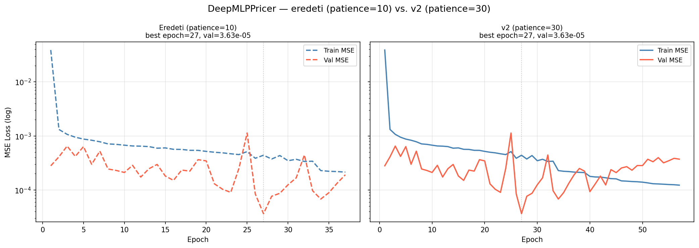
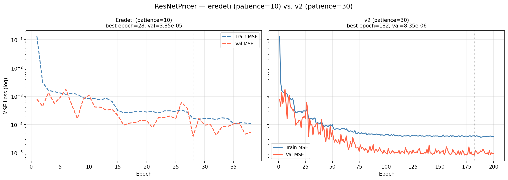
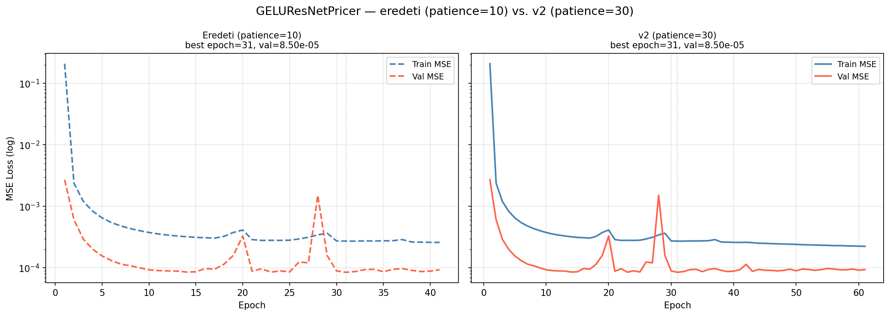
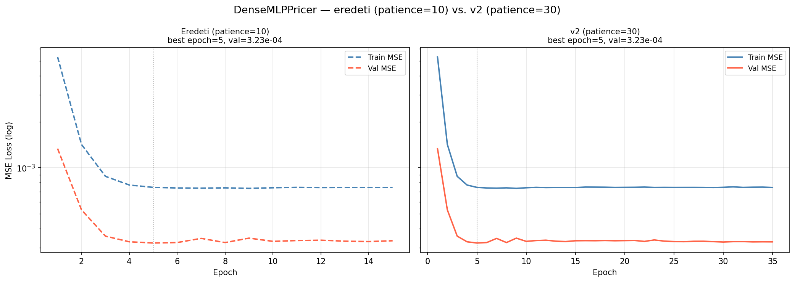
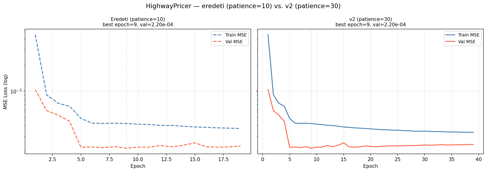
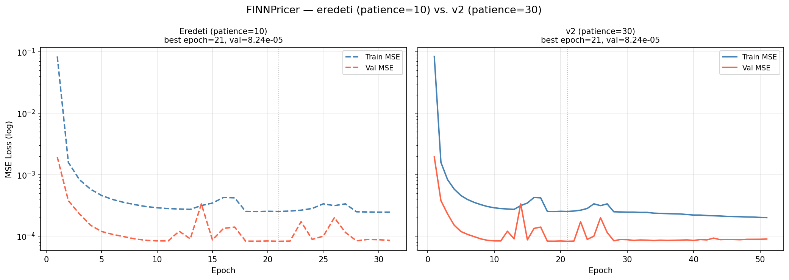
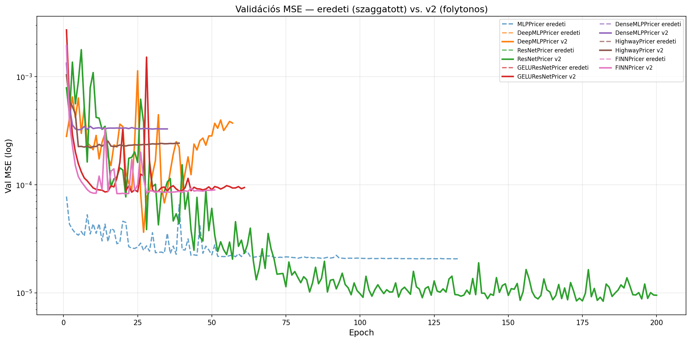
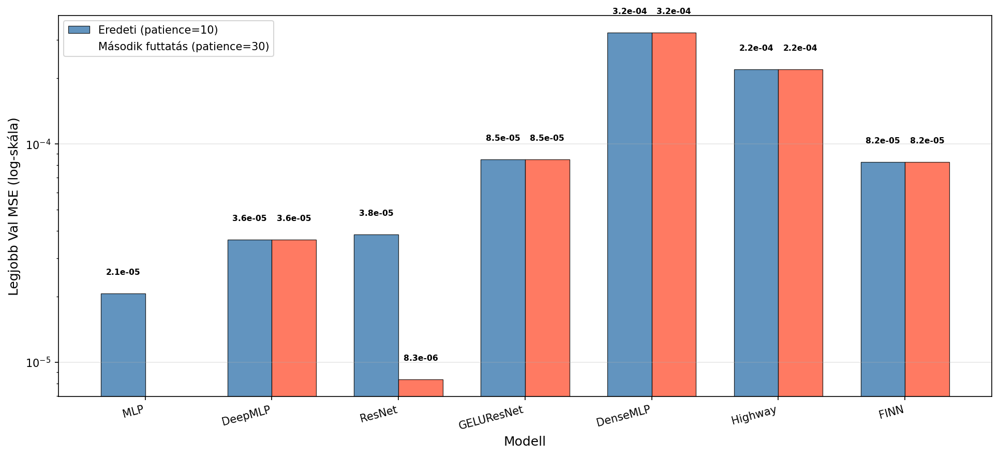
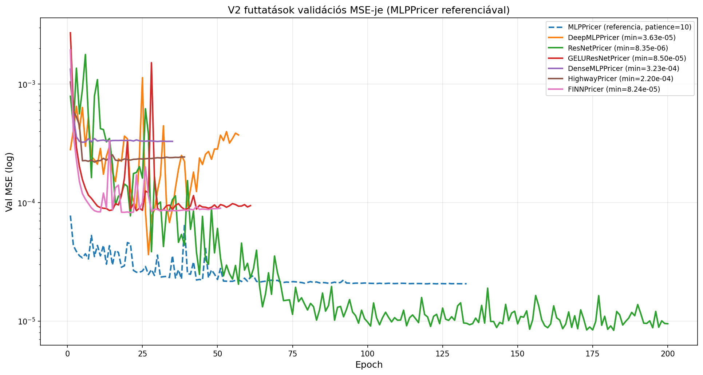
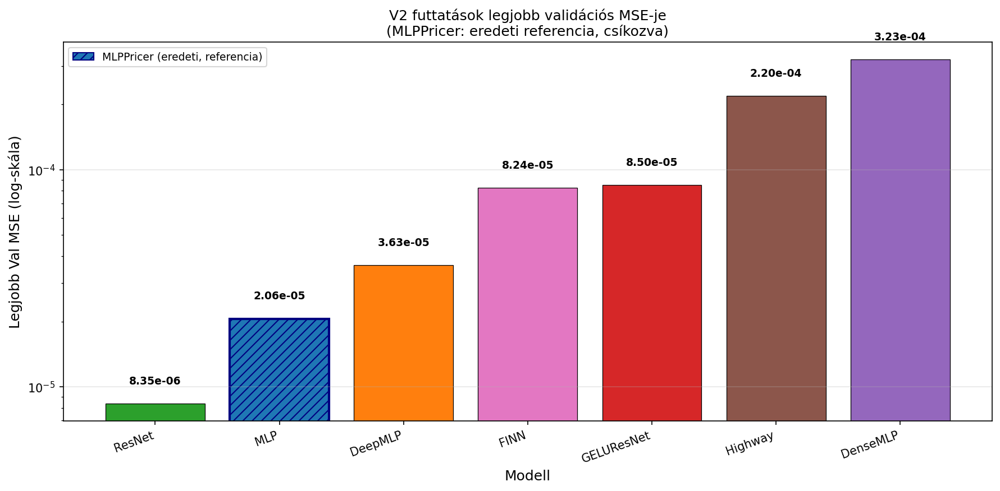

# Early stopping hatása: patience=10 vs. patience=30 (v2 kísérlet)

## 1. Motiváció

Az eredeti kísérletben az early stopping `patience=10` volt beállítva. Ez azt jelenti, hogy a tanítás leállt, ha 10 egymás utáni epochon át nem javult a validációs MSE. A kísérlet utólagos kiértékelésekor felmerült a kérdés: elegendő volt-e ez az érték, vagy egyes modellek korábban álltak le a tényleges optimumukhoz képest?

A v2 kísérlet célja ennek empirikus tisztázása: ugyanazokkal a hiperparaméterekkel, azonos véletlenszámmal (seed=42), de `patience=30`-cal újrafuttatni az összes komplex architektúrát (az MLPPricer kivételével, amely az eredeti 123 epochos tanulásával már bizonyítottan nem szenvedett korai megállástól).

---

## 2. Kísérleti beállítások

| Hiperparaméter  | Eredeti (v1) | v2        |
|-----------------|--------------|-----------|
| `patience`      | 10           | **30**    |
| `epochs` (max)  | 200          | 200       |
| `batch_size`    | 4096         | 4096      |
| `lr`            | 1e-3         | 1e-3      |
| `weight_decay`  | 1e-4         | 1e-4      |
| `seed`          | 42           | 42        |

Az azonos seed garantálja, hogy a modellek bit-azonos súlyokkal indultak, és az adatok véletlenszerű sorrendje is megegyezik. Ha a legjobb epoch is megegyezik, az azt bizonyítja, hogy az eredeti futtatás nem volt korai megállás áldozata.

---

## 3. Eredmények összehasonlítása

### 3.1 Részletes összehasonlítás

| Modell           | Eredeti epochok | Eredeti best epoch | Eredeti val MSE | V2 epochok | V2 best epoch | V2 val MSE    | Javulás  |
|------------------|-----------------|--------------------|-----------------|------------|---------------|---------------|----------|
| DeepMLPPricer    | 37              | 27                 | 3.6347e-05      | 57         | 27            | 3.6347e-05    | —        |
| ResNetPricer     | 38              | 28                 | 3.8462e-05      | **200**    | **182**       | **8.3475e-06**| **~78%** |
| GELUResNetPricer | 41              | 31                 | 8.4989e-05      | 61         | 31            | 8.4989e-05    | —        |
| DenseMLPPricer   | 15              | 5                  | 3.2283e-04      | 35         | 5             | 3.2283e-04    | —        |
| HighwayPricer    | 19              | 9                  | 2.1954e-04      | 39         | 9             | 2.1954e-04    | —        |
| FINNPricer       | 31              | 21                 | 8.2406e-05      | 51         | 21            | 8.2406e-05    | —        |

> **Megjegyzés:** A v2 esetén az epochszám = best epoch + 30 (patience), kivéve a ResNetPricert, amely elérte a 200 epochos maximumot.

### 3.2 Frissített végső rangsor (v2 eredményekkel)

| Rang | Modell            | Legjobb val MSE | Forrás      |
|------|-------------------|-----------------|-------------|
| 1.   | **ResNetPricer**  | **8.3475e-06**  | **v2**      |
| 2.   | MLPPricer         | 2.0607e-05      | eredeti     |
| 3.   | DeepMLPPricer     | 3.6347e-05      | eredeti = v2 |
| 4.   | FINNPricer        | 8.2406e-05      | eredeti = v2 |
| 5.   | GELUResNetPricer  | 8.4989e-05      | eredeti = v2 |
| 6.   | HighwayPricer     | 2.1954e-04      | eredeti = v2 |
| 7.   | DenseMLPPricer    | 3.2283e-04      | eredeti = v2 |

A patience=30 csak egyetlen modell esetén változtatott az eredményen, de ott drasztikusan: a ResNetPricer a korábban 3. helyről az **1. helyre** ugrott, és az addigi legjobb modellt (MLPPricer) is ~2,5-szörös különbséggel múlta felül.

---

## 4. Részletes elemzés modellenként

### 4.1 ResNetPricer — az egyetlen lényeges javulás

**Eredeti:** best epoch=28, val MSE = 3.8462e-05, tanítás megállt a 38. epochban.

**V2:** best epoch=182, val MSE = 8.3475e-06, tanítás a 200. epochig futott (maximumig).

**Javulás:** (3.8462e-05 − 8.3475e-06) / 3.8462e-05 ≈ **78,3%** csökkentés, azaz ~4,6-szoros pontosságnövekedés.

A ResNetPricer validációs görbéje az eredeti kísérletben erősen oszcillált — ez a BatchNorm ismert viselkedése: batch- és populáció-statisztikák eltérése miatt a validációs loss zajosabb, mint LayerNorm esetén. Az oszcilláció elfedte, hogy a modell valójában még jóval tovább tanult volna: a v2-ben a validációs loss a 28. epoch utáni platónak tűnő szakaszból csak az 50-es epochok táján kezdett el szisztematikusan csökkenni, majd a 90-200. epoch között fokozatosan jutott el 3.8e-05-ről 8.3e-06-ra.

Az LR scheduling is sokat segített: a ReduceLROnPlateau az 1e-3 értéket fokozatosan 1e-6-ra csökkentette (9 lépésben), ami a 200. epochra nagyon finom, konzisztens finomhangolást tett lehetővé.

**Konklúzió:** A patience=10 a ResNetPricernél valóban korai megállást okozott — a BatchNorm-indukált validációs zaj miatt a patience érdemi szerepet játszott. Ez az egyetlen modell, amelynél az újrafuttatás ténylegesen jobb eredményre vezetett.

### 4.2 DeepMLPPricer — a patience irreleváns volt

**Eredeti:** best epoch=27, val MSE = 3.6347e-05.

**V2:** best epoch=27, val MSE = 3.6347e-05 — azonos, bit-pontos.

Az eredeti futtatás best epoch=27-en állt meg. A v2 a 27. epoch utáni 30 epochon (28–57) sem tudott jobbat elérni: a validációs veszteség szisztematikusan romlott (7.6e-05, 8.7e-05, 1.2e-04, ..., 3.7e-04 a végén). Ez egyértelműen jelzi, hogy a modell a 27. epochban ténylegesen elérte a legjobb általánosítási képességét, és a patience=10 elegendő volt.

### 4.3 GELUResNetPricer — stagnálás, nem korai megállás

**Eredeti:** best epoch=31, val MSE = 8.4989e-05.

**V2:** best epoch=31, val MSE = 8.4989e-05 — azonos.

A 31. epoch utáni 30 extra epochon (32–61) a validációs loss 8.5e-05 körül oszcillált (néha 9.8e-05-ig is felment), de nem javult. A modell valóban elérte a kapacitáskorlátját ennél a tanítási konfigurációnál.

### 4.4 FINNPricer — megerősített stagnálás

**Eredeti:** best epoch=21, val MSE = 8.2406e-05.

**V2:** best epoch=21, val MSE = 8.2406e-05 — azonos.

A 22–51. epochok közötti validációs loss 8.3–9.3e-05 között mozgott, enyhén emelkedő trendtel (az 50. epochra 8.96e-05). A modell enyhe overfittingre utal a 21. epoch után, de a különbség nem szignifikáns. A patience=10 elegendő volt.

### 4.5 DenseMLPPricer — architektúrakorlát, nem early stopping

**Eredeti:** best epoch=5, val MSE = 3.2283e-04, tanítás megállt a 15. epochban.

**V2:** best epoch=5, val MSE = 3.2283e-04, tanítás megállt a 35. epochban.

Ez a modell volt az egyik legmeglepőbb eset. A validációs loss az 5. epoch után 0.000328–0.000340 között oszcillált és stagnált, miközben a **train loss az egész 35 epochon át folyamatosan csökkent** (0.000745 → 0.000744 a 35. epochra — nagyon lassan, de csökken). Ez klassszikus tünet: a modell a tanítóhalmazon tanul, de nem generalizál a validációs halmazra.

A DenseMLPPricer esetén a probléma nem az early stopping volt, hanem az architektúra generalizációs korlátja — a DenseNet-stílusú összefűzés (minden réteg bemenetéül az összes korábbi réteg kimenetét megkapja) ebben a konfigurációban (hidden_dim=128, n_layers=4) nem tudta megtanulni a Black-Scholes függvényt a validációs halmazra is kiterjedő minőségben.

### 4.6 HighwayPricer — train/val divergencia

**Eredeti:** best epoch=9, val MSE = 2.1954e-04, tanítás megállt a 19. epochban.

**V2:** best epoch=9, val MSE = 2.1954e-04, tanítás megállt a 39. epochban.

A HighwayPricer a v2-ben a legtanulságosabb viselkedést mutatta: a train loss az eredeti 19 epochos értékről (0.000377) a v2 39. epochjáig 0.000335-re csökkent — érdemi javulás. Ezzel szemben a val loss a 9. epoch utáni 30 epochon át (10–39) 0.000220–0.000242 sávban maradt, majd enyhén emelkedett a végére (0.000242 a 39. epochban). Ez egyértelmű **overfitting**: a modell mélyebben tanulja a tanítókészletet, de ez nem transzferálódik a validációra.

A Highway gating mechanizmus (Srivastava et al., 2015) esetén a gate-ek tanítása a korai epochokban stabilizálódik, és ezután a modell az LR csökkentéssel már nem tud kellő mértékű generalizálható javulást elérni.

---

## 5. Összefoglaló következtetések

### 5.1 A patience=10 értékelése

A hat vizsgált modellből **öt esetén** a patience=10 elegendőnek bizonyult: a legjobb epoch és validációs MSE megegyezett az eredeti és a v2 futtatásban. Ez azt jelzi, hogy az original kísérletben az early stopping ezekre a modellekre nem volt félrevezető — a modellek valóban elérték a legjobb általánosítási képességüket.

Az **egyetlen kivétel a ResNetPricer** volt, ahol a BatchNorm-indukált validációs zaj miatt a patience=10 valóban korai megállást okozott. A patience=30-ra való növelés itt ~4,6-szoros pontosságjavulást hozott (3.8462e-05 → 8.3475e-06).

### 5.2 A BatchNorm és a patience kapcsolata

A ResNetPricer és a GELUResNetPricer közötti különbség szemléletesen illusztrálja a BatchNorm és LayerNorm eltérő viselkedését az early stopping szempontjából:

- **ResNetPricer (BatchNorm):** noisy validációs görbe → a batch-statisztikák és a futó átlag divergenciája miatt a validációs loss jobban oszcillál → magasabb patience kell a tényleges trendek azonosításához.
- **GELUResNetPricer (LayerNorm):** stabilabb validációs görbe → a patience=10 elegendő volt.

Ez a megfigyelés azt javasolja, hogy BatchNorm-alapú modellekhez általánosan érdemes magasabb patience-t alkalmazni.

### 5.3 DenseMLPPricer és HighwayPricer értékelése

Mindkét modell esetén a v2 futtatás megerősítette, hogy nem korai megállásról, hanem **architektúrakorlátról** van szó:

- A DenseMLPPricer train/val divergenciája a DenseNet összefűzési séma sub-optimális viselkedésére utal ennél a feladatnál és konfigurációnál.
- A HighwayPricer egyértelmű overfittinget mutat a 9. epoch után — a tanítási loss tovább csökkent, miközben a validációs loss stagnált, sőt enyhén emelkedett.

Mindkét modell javítása inkább hiperparaméter-optimalizálással (hidden_dim, dropout, lr) vagy az architektúra módosításával érhető el, nem a patience növelésével.

### 5.4 A végleges modellrangsor

A v2 kísérlet alapján a ResNetPricer a legjobb modell a vizsgált architektúrák közül:

| Modell           | Best val MSE   | Megjegyzés                        |
|------------------|----------------|-----------------------------------|
| ResNetPricer     | 8.3475e-06     | v2 (patience=30), 182 epoch       |
| MLPPricer        | 2.0607e-05     | eredeti, 123 epoch                |
| DeepMLPPricer    | 3.6347e-05     | eredeti = v2                      |
| FINNPricer       | 8.2406e-05     | eredeti = v2                      |
| GELUResNetPricer | 8.4989e-05     | eredeti = v2                      |
| HighwayPricer    | 2.1954e-04     | eredeti = v2 (overfitting)        |
| DenseMLPPricer   | 3.2283e-04     | eredeti = v2 (architektúrakorlát) |

---

## 6. Grafikonok

### Egyedi összehasonlítók (eredeti vs. v2)

| Modell           | Összehasonlító görbe                                                                                  |
|------------------|------------------------------------------------------------------------------------------------------|
| DeepMLPPricer    |                               |
| ResNetPricer     |                                 |
| GELUResNetPricer |                         |
| DenseMLPPricer   |                             |
| HighwayPricer    |                               |
| FINNPricer       |                                     |

### Összesített overlay és bar chart

**Val MSE overlay (szaggatott = eredeti, folytonos = v2):**

**Legjobb val MSE összehasonlítás (grouped bar):**

### V2-only ábrák

**V2 összesített val MSE (MLPPricer referenciaként):**

**V2 legjobb val MSE bar chart (csökkenő sorrendben):**

---

*Kísérlet dátuma: 2026-05-21 | Projekt: Önálló laboratórium, 6. félév*
